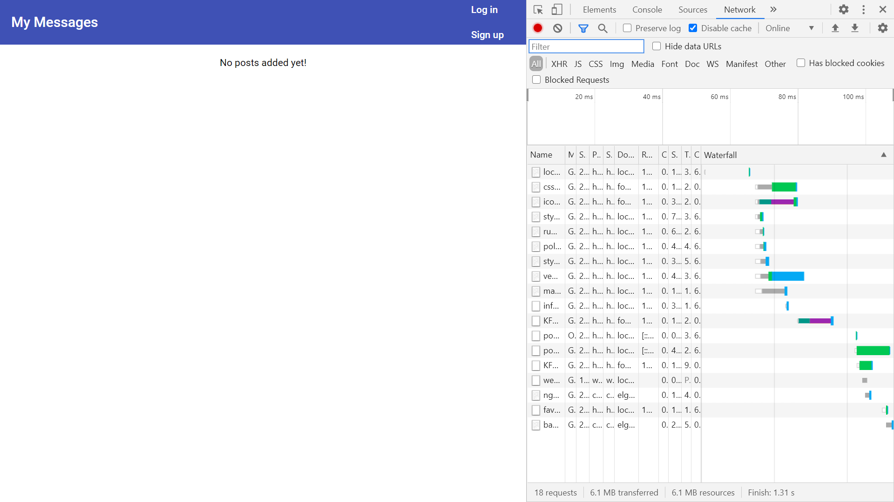

# :zap: Mean Full Stack App

* Mongo Express Angular Node (MEAN) full-stack app, integrates Angular 11 frontend with Node.js backend.

*** Note: to open web links in a new window use: _ctrl+click on link_**

## :page_facing_up: Table of contents

* [:zap: Mean Full Stack App](#zap-mean-full-stack-app)
  * [:page_facing_up: Table of contents](#page_facing_up-table-of-contents)
  * [:books: General info](#books-general-info)
  * [:camera: Screenshots](#camera-screenshots)
  * [:signal_strength: Technologies](#signal_strength-technologies)
  * [:floppy_disk: Frontend & Backend Setup](#floppy_disk-frontend--backend-setup)
  * [:computer: Code Examples](#computer-code-examples)
  * [:cool: Features](#cool-features)
  * [:clipboard: Status & To-Do List](#clipboard-status--to-do-list)
  * [:clap: Inspiration](#clap-inspiration)
  * [:envelope: Contact](#envelope-contact)

## :books: General info

* includes signup and login forms
* user id and post details stored in MongoDB cloud Atlas database
* full Create Read Update and Delete (CRUD) database functionality
* uses the [Angular canActive interface](https://angular.io/api/router/CanActivate) as a guard deciding if a route can be activated
* The error component is an Entry component but since 9.0.0 with Ivy, the entryComponents property is no longer necessary. See deprecations guide.

## :camera: Screenshots



## :signal_strength: Technologies

* [MongoDB Cloud Atlas](https://www.mongodb.com/cloud/atlas)
* [npm mongodb v3](https://www.npmjs.com/package/mongodb) official MongoDB driver for Node.js
* [Express.js middleware v4](https://expressjs.com/)
* [Angular framework v11](https://angular.io/)
* [Angular Reactive Forms](https://angular.io/guide/reactive-forms) built around observable streams
* [Node.js v12](https://nodejs.org/es/)
* [multer v1](https://www.npmjs.com/package/multer) node.js middleware for handling multipart/form-data to upload files

## :floppy_disk: Frontend & Backend Setup

* Install dependencies using `npm i`
* Backend: Add `backend/.env file` with `ATLAS_URI` then run `nodemon server.js` to start server
* Frontend: Run `ng serve` for a dev server then navigate to `http://localhost:4200/`.
* Run `ng build` to build the project. The build artifacts will be stored in the `dist/` directory. Use the `--prod` flag for a production build.

## :computer: Code Examples

* extract from `error-interceptor.ts`

```typescript
// intercept method; attached to every outgoing http request
  intercept(req: HttpRequest<any>, next: HttpHandler) {
    return next.handle(req).pipe(
      catchError((error: HttpErrorResponse) => {
        let errorMessage = 'An unknown error occured';
        if (error.error.message) {
          errorMessage = error.error.message;
          this.dialog.open(ErrorComponent, { data: { message: errorMessage } });
        }
        return throwError(error);
      })
    );
  }
```

## :cool: Features

* Spinner is displayed while data loading, controlled by a boolean valuexº

## :clipboard: Status & To-Do List

* Status: Incomplete. Sign-up and Login work but not possible to add posts - form to create a post is not shown
* To-Do: Show add post form

## :clap: Inspiration

* [MEAN Stack Tutorial)](https://www.javatpoint.com/mean-stack)
* [Stackoverflow: Can't connect mongoDB database to Atlas due to server and shell mismatch
](https://stackoverflow.com/questions/58729984/cant-connect-mongodb-database-to-atlas-due-to-server-and-shell-mismatch)

## :envelope: Contact

* Repo created by [ABateman](https://www.andrewbateman.org) - you are welcome to [send me a message](https://andrewbateman.org/contact)
